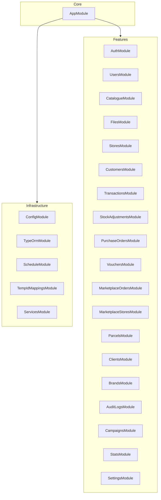

# KasiPOS Backend — Open Source Documentation

**Language:** English — See also [BACKEND.fr.md](./BACKEND.fr.md) (Français).

This document describes the KasiPOS backend API service: how to run it, how it is structured, how it is licensed under **Apache License 2.0**, and how to use **Swagger UI** and the OpenAPI document for exploratory and manual end-to-end–style API testing.

---

## 1. Introduction

**KasiPOS Backend** is a [NestJS](https://nestjs.com/) application that provides HTTP APIs for **KasiPOS**, an offline-first Point of Sale system. It persists business data in **PostgreSQL** (via **TypeORM**), authenticates clients with **JWT** (Passport), and optionally stores files on **S3-compatible object storage** (e.g. DigitalOcean Spaces).

The companion **frontend PWA** (`kasiPOS-frontend`) uses local storage when offline and syncs to this backend when online. This guide focuses on the backend only; it does not replace frontend documentation.

---

## 2. Open source and Apache License 2.0

The KasiPOS backend is distributed under the **[Apache License, Version 2.0](https://www.apache.org/licenses/LICENSE-2.0)**. The **full legal terms** are in the [`LICENSE`](../LICENSE) file in this package. The following is a **non-binding summary** for developers; when in doubt, read the license text.

| Topic | Summary |
|--------|--------|
| **Use** | You may use, copy, and distribute the software. |
| **Modification** | You may modify and distribute modified versions. |
| **Patents** | The license includes an express patent grant, subject to its conditions. |
| **Notices** | You must retain **copyright**, **license**, and **notice** files (e.g. `LICENSE`, and `NOTICE` if present) in distributions. |
| **Changes** | If you distribute modified files, you should **state that you changed them**. |
| **Trademarks** | The license **does not grant trademark rights**; do not imply endorsement. |
| **Warranty** | The software is provided **“AS IS”**, without warranties; see Section 7–8 of the license. |

**Contributing:** Contributions are welcome via issues and pull requests against this repository. By contributing, you agree that your contributions can be licensed under the same terms as the project (Apache 2.0), unless you explicitly state otherwise.

---

## 3. Architecture

### 3.1 High-level stack

- **Runtime:** Node.js (v18+ recommended)
- **Framework:** NestJS 11
- **ORM:** TypeORM with PostgreSQL
- **Auth:** JWT + Passport (`passport-jwt`)
- **Validation:** `class-validator` / `class-transformer` (global `ValidationPipe`)
- **Scheduling:** `@nestjs/schedule`
- **API docs:** `@nestjs/swagger` (Swagger UI + OpenAPI)

### 3.2 Cross-cutting behavior

- **Temporary client IDs:** `TempIdResolveInterceptor` resolves temporary client IDs for certain operations.
- **Audit:** `AuditLogInterceptor` records audit events for supported actions.

### 3.3 Feature modules

The root module wires the following feature areas (see [`src/app.module.ts`](../src/app.module.ts)):



**Catalogue** includes nested resources: **categories**, **category-templates**, **products**, **product-templates** (each exposed under its own controller path; see section 8).

---

## 4. Prerequisites and installation

### 4.1 Prerequisites

- **Node.js** v18 or higher
- **PostgreSQL** v12 or higher
- **npm** or **yarn**

### 4.2 Install dependencies

```bash
cd kasiPOS-backend
npm install
```

### 4.3 Environment file

```bash
cp .env.example .env
```

Edit `.env` for your machine (see section 5).

---

## 5. Configuration

Never commit real secrets. Use strong values for `JWT_SECRET` in any shared or production environment.

### 5.1 Variables (from `.env.example`)

| Variable | Purpose |
|----------|---------|
| `DB_HOST` | PostgreSQL host |
| `DB_PORT` | PostgreSQL port |
| `DB_USERNAME` | Database user |
| `DB_PASSWORD` | Database password |
| `DB_DATABASE` | Database name |
| `DATABASE_URL` | Optional: used in production when set (see `database.config.ts`) |
| `JWT_SECRET` | Signing secret for JWTs |
| `JWT_EXPIRES_IN` | JWT lifetime (e.g. `7d`) |
| `OTP_CODE_LENGTH` | OTP digit length |
| `OTP_EXPIRY_MINUTES` | OTP validity window |
| `WINSMS_USERNAME` | SMS provider (WinSMS) username |
| `WINSMS_PASSWORD` | SMS provider password |
| `PORT` | HTTP port for the API |
| `NODE_ENV` | `development`, `production`, etc. |
| `FRONTEND_URL` | CORS origin(s); comma-separated allowed origins |
| `DO_SPACES_ENDPOINT` | S3-compatible endpoint URL |
| `DO_SPACES_REGION` | Region identifier |
| `DO_SPACES_ACCESS_KEY_ID` | Access key |
| `DO_SPACES_SECRET_ACCESS_KEY` | Secret key |
| `DO_SPACES_BUCKET` | Bucket name |
| `MAX_FILE_SIZE` | Max upload size in bytes (default in example: 2097152) |

---

## 6. Database

### 6.1 Create database

```sql
CREATE DATABASE kasipos;
```

(Use the same name as `DB_DATABASE` unless you override it.)

### 6.2 Migrations

TypeORM migrations are enabled with `synchronize: false`. Apply pending migrations:

```bash
npm run migration:run
```

Other useful commands:

- `npm run migration:show` — status
- `npm run migration:revert` — revert last migration
- `npm run migration:generate` / `migration:create` — create migrations (see `src/database/data-source.ts`)

### 6.3 Seeds (optional)

```bash
npm run seed:run
npm run seed:clear
```

---

## 7. Running the server

### 7.1 Development

```bash
npm run start:dev
```

### 7.2 URLs (important distinction)

There is **no global `/api` prefix** on REST controllers. Paths like `/auth/login` are served from the **server root**.

| What | URL pattern |
|------|-------------|
| **REST API base** | `http://localhost:<PORT>` (example: `http://localhost:3001`) |
| **API metadata** | `GET http://localhost:<PORT>/` — returns name, version, description, and a pointer to documentation |
| **Swagger UI** | `http://localhost:<PORT>/api` |
| **OpenAPI JSON** | `http://localhost:<PORT>/api-json` (default for NestJS when UI is mounted at `/api`) |

Replace `<PORT>` with your `PORT` value from `.env` (the example file uses `3001`).

### 7.3 Production build

```bash
npm run build
npm run start:prod
```

---

## 8. API discovery and route map

Controllers are registered **without** a global API prefix. Typical **path prefixes** include:

| Prefix | Area |
|--------|------|
| `/auth` | Authentication (OTP, login, tokens, profile) |
| `/users` | Users |
| `/stores` | Stores |
| `/customers` | Customers |
| `/transactions` | Transactions |
| `/stock-adjustments` | Stock adjustments |
| `/purchase-orders` | Purchase orders |
| `/vouchers` | Vouchers |
| `/marketplace-orders` | Marketplace orders |
| `/marketplace-stores` | Marketplace stores |
| `/parcels` | Parcels |
| `/clients` | Clients |
| `/brands` | Brands |
| `/audit-logs` | Audit logs |
| `/campaigns` | Campaigns |
| `/stats` | Statistics |
| `/settings` | Store settings |
| `/files` | File uploads |
| `/categories` | Catalogue: categories |
| `/category-templates` | Catalogue: category templates |
| `/products` | Catalogue: products |
| `/product-templates` | Catalogue: product templates |

Exact HTTP methods and bodies are defined in source controllers and in **Swagger**.

**Frontend configuration:** Point the client at the **REST root** (no `/api` suffix for JSON endpoints), e.g. `NEXT_PUBLIC_API_BASE_URL=http://localhost:3001`, unless your deployment adds a reverse-proxy prefix.

---

## 9. Swagger / OpenAPI for manual E2E-style testing

Swagger exposes an **interactive UI** to call the API without writing a test suite. This is ideal for **smoke tests** and **end-to-end-style flows** during development.

### 9.1 Open Swagger UI

1. Start the server (`npm run start:dev`).
2. Open a browser at: `http://localhost:<PORT>/api`.
3. You should see **KasiPOS API** with grouped tags (e.g. Authentication, Users).

### 9.2 OpenAPI machine-readable spec

- **JSON**: `GET http://localhost:<PORT>/api-json`  
  Use this to import the API into **Postman**, **Insomnia**, codegen tools, or contract tests.

### 9.3 JWT authorization in Swagger

Protected routes use Bearer JWT. The application registers the security scheme name **`JWT-auth`** (see `main.ts`).

1. Authenticate via the documented flow (e.g. OTP or login endpoints under **`Authentication`**).
2. Copy the **access token** returned by the API.
3. In Swagger UI, click **Authorize**.
4. In the **JWT-auth** (Bearer) field, paste the token. (If the UI expects the raw token only, omit a duplicate `Bearer ` prefix if one is added automatically.)

After authorization, **Execute** protected operations (e.g. user or store management) in a logical order: **authenticate → dependent reads/writes**.

### 9.4 Suggested manual E2E-style checklist

1. **Public/auth:** Request OTP → verify OTP → login or set password as applicable; confirm you receive a JWT.
2. **Authorize** in Swagger with that JWT.
3. **Read:** List or get a small resource you expect to exist (e.g. current user profile).
4. **Write:** Create or update a resource; then **read** again to verify persistence.
5. **Error paths:** Repeat with invalid body, missing auth, or wrong IDs to confirm expected HTTP status codes.

For OTP/SMS, local testing may require valid `WINSMS_*` credentials or test doubles; without SMS, some auth steps cannot complete end-to-end.

---

## 10. Automated tests

| Command | Purpose |
|---------|---------|
| `npm run test` | Unit tests (`*.spec.ts` under `src/`) |
| `npm run test:watch` | Unit tests in watch mode |
| `npm run test:cov` | Unit tests with coverage |
| `npm run test:e2e` | E2E tests (`jest-e2e.json`) |

The repository includes an E2E Jest configuration under `test/`. Add `*.e2e-spec.ts` files there to automate HTTP-level tests; until then, prefer **Swagger** or external clients for API E2E validation.

---

## 11. Troubleshooting

| Issue | Checks |
|-------|--------|
| **CORS errors in browser** | Set `FRONTEND_URL` to your frontend origin(s); multiple values can be comma-separated in code that splits them. |
| **Cannot connect to DB** | Verify `DB_*` / `DATABASE_URL`, PostgreSQL is running, database exists, migrations applied. |
| **Port already in use** | Change `PORT` in `.env`. |
| **OTP never arrives** | Confirm `WINSMS_*` and network access to the SMS API. |
| **401 on protected routes** | Token expired or wrong scheme; re-login and set **JWT-auth** again in Swagger. |
| **404 on `/api/...` JSON calls** | REST routes are **not** under `/api`; only Swagger lives there. Call `/auth`, `/users`, etc. at the server root. |

---

## 12. Further reading

- [NestJS documentation](https://docs.nestjs.com/)
- [Apache License 2.0](https://www.apache.org/licenses/LICENSE-2.0)
- Project [`README.md`](../README.md) — quick start and scripts
