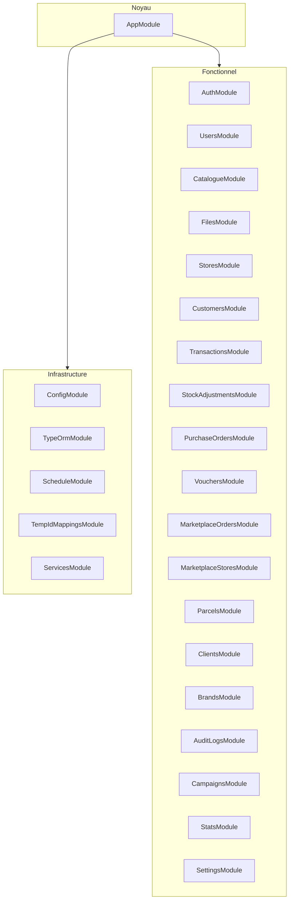

# KasiPOS Backend — Documentation open source

**Langue :** Français — Voir aussi [BACKEND.en.md](./BACKEND.en.md) (English).

Ce document décrit le service d’API backend KasiPOS : comment l’exécuter, comment il est structuré, sous quelle licence **Apache License 2.0** il est distribué, et comment utiliser **Swagger UI** ainsi que le document OpenAPI pour des tests exploratoires et des scénarios de bout en bout **manuels** sur les endpoints.

---

## 1. Introduction

**KasiPOS Backend** est une application [NestJS](https://nestjs.com/) qui expose des API HTTP pour **KasiPOS**, un système de point de vente *offline-first*. Il persiste les données métier dans **PostgreSQL** (via **TypeORM**), authentifie les clients avec des **JWT** (Passport) et peut stocker des fichiers sur un **stockage objet compatible S3** (ex. DigitalOcean Spaces).

Le **PWA frontend** associé (`kasiPOS-frontend`) conserve les données en local hors ligne et se synchronise avec ce backend lorsqu’il est en ligne. Ce guide ne couvre que le backend ; il ne remplace pas la documentation du frontend.

---

## 2. Open source et Apache License 2.0

Le backend KasiPOS est distribué sous la **[Apache License, Version 2.0](https://www.apache.org/licenses/LICENSE-2.0)**. Les **termes juridiques complets** figurent dans le fichier [`LICENSE`](../LICENSE) de ce paquet. Ce qui suit est un **résumé non contractuel** pour les développeurs ; en cas de doute, lisez le texte de la licence.

| Sujet | Résumé |
|--------|--------|
| **Utilisation** | Vous pouvez utiliser, copier et distribuer le logiciel. |
| **Modification** | Vous pouvez modifier et distribuer des versions modifiées. |
| **Brevets** | La licence inclut une concession de brevets expresse, sous conditions. |
| **Mentions** | Vous devez conserver les **mentions de droits d’auteur**, la **licence** et les **fichiers de notice** (p. ex. `LICENSE`, et `NOTICE` le cas échéant) dans les distributions. |
| **Modifications** | Si vous distribuez des fichiers modifiés, vous devez **indiquer les changements**. |
| **Marques** | La licence **n’accorde pas de droits sur les marques** ; n’impliquez pas d’approbation. |
| **Garantie** | Le logiciel est fourni **« EN L’ÉTAT »**, sans garantie ; voir les sections 7–8 de la licence. |

**Contributions :** Les contributions sont les bienvenues via des *issues* et des *pull requests* sur ce dépôt. En contribuant, vous acceptez que vos contributions puissent être publiées sous les mêmes conditions que le projet (Apache 2.0), sauf mention contraire explicite.

---

## 3. Architecture

### 3.1 Pile technique (vue d’ensemble)

- **Runtime :** Node.js (v18+ recommandé)
- **Framework :** NestJS 11
- **ORM :** TypeORM avec PostgreSQL
- **Auth :** JWT + Passport (`passport-jwt`)
- **Validation :** `class-validator` / `class-transformer` (`ValidationPipe` global)
- **Planification :** `@nestjs/schedule`
- **Documentation API :** `@nestjs/swagger` (Swagger UI + OpenAPI)

### 3.2 Comportements transverses

- **IDs clients temporaires :** `TempIdResolveInterceptor` résout les identifiants temporaires pour certaines opérations.
- **Audit :** `AuditLogInterceptor` enregistre des événements d’audit pour les actions prises en charge.

### 3.3 Modules fonctionnels

Le module racine assemble les domaines suivants (voir [`src/app.module.ts`](../src/app.module.ts)) :



Le **catalogue** regroupe notamment : **categories**, **category-templates**, **products**, **product-templates** (chacun avec son propre préfixe de contrôleur ; voir la section 8).

---

## 4. Prérequis et installation

### 4.1 Prérequis

- **Node.js** v18 ou supérieur
- **PostgreSQL** v12 ou supérieur
- **npm** ou **yarn**

### 4.2 Installation des dépendances

```bash
cd kasiPOS-backend
npm install
```

### 4.3 Fichier d’environnement

```bash
cp .env.example .env
```

Modifiez `.env` selon votre poste (voir la section 5).

---

## 5. Configuration

Ne commitez jamais de secrets réels. Utilisez des valeurs robustes pour `JWT_SECRET` dans tout environnement partagé ou de production.

### 5.1 Variables (d’après `.env.example`)

| Variable | Rôle |
|----------|------|
| `DB_HOST` | Hôte PostgreSQL |
| `DB_PORT` | Port PostgreSQL |
| `DB_USERNAME` | Utilisateur base de données |
| `DB_PASSWORD` | Mot de passe |
| `DB_DATABASE` | Nom de la base |
| `DATABASE_URL` | Optionnel : utilisé en production si défini (voir `database.config.ts`) |
| `JWT_SECRET` | Secret de signature des JWT |
| `JWT_EXPIRES_IN` | Durée de vie des JWT (ex. `7d`) |
| `OTP_CODE_LENGTH` | Longueur du code OTP |
| `OTP_EXPIRY_MINUTES` | Fenêtre de validité du OTP |
| `WINSMS_USERNAME` | Identifiant API SMS (WinSMS) |
| `WINSMS_PASSWORD` | Mot de passe API SMS |
| `PORT` | Port HTTP de l’API |
| `NODE_ENV` | `development`, `production`, etc. |
| `FRONTEND_URL` | Origine(s) CORS ; origines multiples possibles séparées par des virgules |
| `DO_SPACES_ENDPOINT` | URL du endpoint compatible S3 |
| `DO_SPACES_REGION` | Région |
| `DO_SPACES_ACCESS_KEY_ID` | Clé d’accès |
| `DO_SPACES_SECRET_ACCESS_KEY` | Clé secrète |
| `DO_SPACES_BUCKET` | Nom du bucket |
| `MAX_FILE_SIZE` | Taille max d’upload en octets (exemple : 2097152) |

---

## 6. Base de données

### 6.1 Création de la base

```sql
CREATE DATABASE kasipos;
```

(Utilisez le même nom que `DB_DATABASE` sauf si vous le remplacez.)

### 6.2 Migrations

Les migrations TypeORM sont activées avec `synchronize: false`. Appliquez les migrations en attente :

```bash
npm run migration:run
```

Autres commandes utiles :

- `npm run migration:show` — état
- `npm run migration:revert` — annuler la dernière migration
- `npm run migration:generate` / `migration:create` — créer des migrations (voir `src/database/data-source.ts`)

### 6.3 Jeux de données (optionnel)

```bash
npm run seed:run
npm run seed:clear
```

---

## 7. Démarrage du serveur

### 7.1 Développement

```bash
npm run start:dev
```

### 7.2 URLs (distinction importante)

Il n’y a **pas** de préfixe global `/api` sur les contrôleurs REST. Des chemins comme `/auth/login` sont servis à la **racine** du serveur.

| Élément | Modèle d’URL |
|--------|----------------|
| **Base des API REST** | `http://localhost:<PORT>` (ex. `http://localhost:3001`) |
| **Métadonnées API** | `GET http://localhost:<PORT>/` — renvoie nom, version, description et lien vers la documentation |
| **Swagger UI** | `http://localhost:<PORT>/api` |
| **OpenAPI JSON** | `http://localhost:<PORT>/api-json` (comportement par défaut NestJS lorsque l’UI est montée sur `/api`) |

Remplacez `<PORT>` par la valeur de `PORT` dans `.env` (l’exemple fourni utilise `3001`).

### 7.3 Build de production

```bash
npm run build
npm run start:prod
```

---

## 8. Découverte de l’API et carte des routes

Les contrôleurs sont enregistrés **sans** préfixe global. **Préfixes** courants :

| Préfixe | Domaine |
|---------|---------|
| `/auth` | Authentification (OTP, connexion, jetons, profil) |
| `/users` | Utilisateurs |
| `/stores` | Magasins |
| `/customers` | Clients (CRM) |
| `/transactions` | Transactions |
| `/stock-adjustments` | Ajustements de stock |
| `/purchase-orders` | Bons de commande |
| `/vouchers` | Bons / vouchers |
| `/marketplace-orders` | Commandes marketplace |
| `/marketplace-stores` | Magasins marketplace |
| `/parcels` | Colis |
| `/clients` | Clients (entité `clients`) |
| `/brands` | Marques |
| `/audit-logs` | Journaux d’audit |
| `/campaigns` | Campagnes |
| `/stats` | Statistiques |
| `/settings` | Paramètres magasin |
| `/files` | Téléversement de fichiers |
| `/categories` | Catalogue : catégories |
| `/category-templates` | Catalogue : modèles de catégories |
| `/products` | Catalogue : produits |
| `/product-templates` | Catalogue : modèles de produits |

Les méthodes HTTP exactes et les corps sont définis dans les contrôleurs et dans **Swagger**.

**Configuration frontend :** pointez le client vers la **racine REST** (sans suffixe `/api` pour les endpoints JSON), p.ex. `NEXT_PUBLIC_API_BASE_URL=http://localhost:3001`, sauf si un reverse-proxy ajoute un préfixe en déploiement.

---

## 9. Swagger / OpenAPI pour des tests E2E manuels

Swagger fournit une **interface interactive** pour appeler l’API sans écrire de suite de tests. C’est adapté aux **tests de fumée** et aux **parcours de bout en bout** en développement.

### 9.1 Ouvrir Swagger UI

1. Démarrez le serveur (`npm run start:dev`).
2. Ouvrez le navigateur à : `http://localhost:<PORT>/api`.
3. Vous devriez voir **KasiPOS API** avec des regroupements par balises (ex. Authentication, Users).

### 9.2 Spécification OpenAPI lisible par machine

- **JSON** : `GET http://localhost:<PORT>/api-json`  
  Sert à importer l’API dans **Postman**, **Insomnia**, des outils de génération de code ou des tests de contrat.

### 9.3 Autorisation JWT dans Swagger

Les routes protégées utilisent un JWT Bearer. L’application enregistre le schéma de sécurité nommé **`JWT-auth`** (voir `main.ts`).

1. Authentifiez-vous selon le flux documenté (ex. endpoints OTP ou login sous **`Authentication`**).
2. Copiez le **jeton d’accès** renvoyé par l’API.
3. Dans Swagger UI, cliquez sur **Authorize**.
4. Dans le champ **JWT-auth** (Bearer), collez le jeton. (Si l’UI ajoute déjà `Bearer `, évitez un doublon.)

Après autorisation, **exécutez** les opérations protégées dans un ordre logique : **authentification → lectures/écritures dépendantes**.

### 9.4 Checklist manuelle de type E2E suggérée

1. **Public / auth :** demander un OTP → vérifier l’OTP → connexion ou définition du mot de passe selon le cas ; confirmer la réception d’un JWT.
2. **Authorize** dans Swagger avec ce JWT.
3. **Lecture :** lister ou récupérer une ressource simple (ex. profil utilisateur courant).
4. **Écriture :** créer ou mettre à jour une ressource ; **relire** pour vérifier la persistance.
5. **Erreurs :** répéter avec un corps invalide, sans auth ou avec de mauvais identifiants pour valider les codes HTTP.

Pour l’OTP/SMS, les tests locaux peuvent exiger des identifiants `WINSMS_*` valides ou des bouchons ; sans SMS, certaines étapes d’auth ne peuvent pas aller au bout.

---

## 10. Tests automatisés

| Commande | Rôle |
|----------|------|
| `npm run test` | Tests unitaires (`*.spec.ts` sous `src/`) |
| `npm run test:watch` | Tests unitaires en mode watch |
| `npm run test:cov` | Tests unitaires avec couverture |
| `npm run test:e2e` | Tests E2E (`jest-e2e.json`) |

Le dépôt contient une configuration Jest E2E sous `test/`. Ajoutez des fichiers `*.e2e-spec.ts` pour automatiser des tests HTTP ; en attendant, privilégiez **Swagger** ou un client HTTP pour valider l’API en E2E.

---

## 11. Dépannage

| Problème | Vérifications |
|----------|----------------|
| **Erreurs CORS dans le navigateur** | Définir `FRONTEND_URL` sur l’origine du frontend ; plusieurs valeurs peuvent être séparées par des virgules si le code les traite ainsi. |
| **Impossible de joindre la base** | Vérifier `DB_*` / `DATABASE_URL`, que PostgreSQL tourne, que la base existe et que les migrations sont appliquées. |
| **Port déjà utilisé** | Modifier `PORT` dans `.env`. |
| **OTP jamais reçu** | Vérifier `WINSMS_*` et l’accès réseau à l’API SMS. |
| **401 sur routes protégées** | Jeton expiré ou schéma incorrect ; se reconnecter et redéfinir **JWT-auth** dans Swagger. |
| **404 sur des appels `/api/...` JSON** | Les routes REST ne sont **pas** sous `/api` ; seul Swagger y est. Appeler `/auth`, `/users`, etc. à la racine du serveur. |

---

## 12. Pour aller plus loin

- [Documentation NestJS](https://docs.nestjs.com/)
- [Apache License 2.0](https://www.apache.org/licenses/LICENSE-2.0)
- [`README.md`](../README.md) du projet — démarrage rapide et scripts
