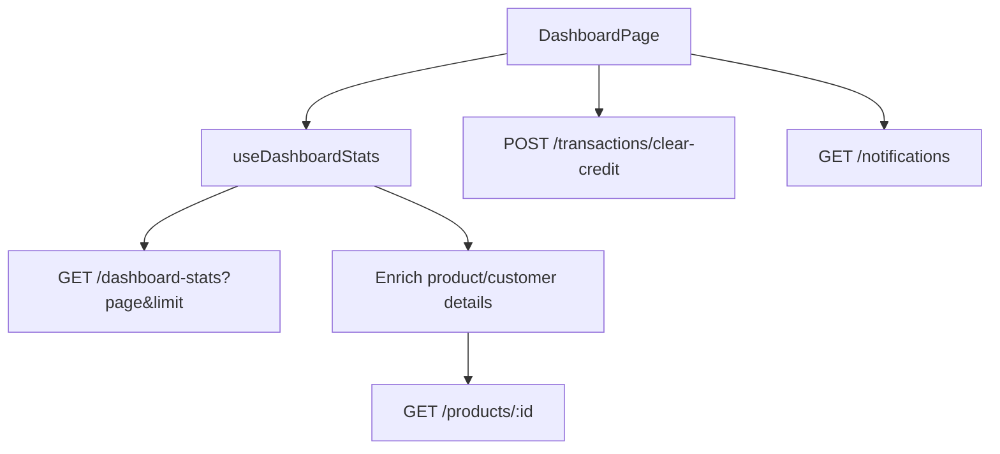

# Frontend: Store Admin Dashboard Implementation

Guide for implementing the kasiPOS store-admin dashboard UI against the backend dashboard APIs.

**Audience:** frontend engineers  
**Role required:** `store_admin`  
**Primary endpoint:** `GET /dashboard-stats`

---

## 1. Screen overview (UI → data)

The dashboard is a single page with five zones:

| UI zone | Purpose | Primary API fields |
|---------|---------|--------------------|
| KPI cards (4) | Today / total sales, customers, outstanding credit | `todaySales`, `totalSales`, `totalCustomers`, `outstandingCredits`, `currency` |
| Actions du jour | Focus cards for today’s recoveries & next due date | `approachingDueDates`, `creditsToRecover`, `overdueCredits` |
| Crédit à récupérer | Table of upcoming credits + “Relancer” | `creditsToRecover` (+ optional `overdueCredits` section) |
| Stock alerts | Low stock + out of stock lists | `lowStockProducts`, `noStockProducts` |
| Product performance | Top sellers + most profitable highlight | `mostSoldProducts`, `mostProfitableProduct` |



---

## 2. Auth & access

- Call only when JWT role is `store_admin`.
- Send `Authorization: Bearer <token>`.
- If `400` (“Store admin must be linked to a store”), show an empty/error state.
- Staff should not see this page (redirect or hide nav item).

---

## 3. API contract

### Request

```http
GET /dashboard-stats?page=1&limit=10
Authorization: Bearer <store_admin_jwt>
```

| Query | Default | Applies to |
|-------|---------|------------|
| `page` | `1` | Shared for `creditsToRecover`, `overdueCredits`, `lowStockProducts`, `noStockProducts` |
| `limit` | `10` | Same four lists |

Use `limit=5` (or similar) if the dashboard preview cards should show ~5 rows like the mock.

### Response (TypeScript)

```ts
type StoreCurrency = 'USD' | 'CDF' | 'ZAR';

type PaginationMeta = {
  total: number;
  page: number;
  limit: number;
  totalPages: number;
};

type DashboardStatsResponse = {
  currency: StoreCurrency;

  // KPI cards
  totalSales: number;
  todaySales: number;
  totalCustomers: number;
  outstandingCredits: number;

  // Daily actions + credit panels
  approachingDueDates: Array<{
    dueDate: string; // ISO
    credits: Array<{ id: string; customerId: string }>;
    clientsOwingCount: number;
    totalAmount: number;
  }>; // 0–2 soonest upcoming due dates (overdue excluded)

  creditsToRecover: {
    data: Array<{
      id: string; // credit transaction id
      clientName: string;
      totalAmount: number;
      dueDate: string; // ISO
    }>;
    meta: PaginationMeta;
  }; // pending + dueDate >= now, ordered by dueDate ASC

  overdueCredits: {
    data: Array<{
      id: string;
      clientName: string;
      totalAmount: number;
      dueDate: string;
    }>;
    meta: PaginationMeta;
  }; // pending + dueDate < now, ordered by dueDate ASC

  // Stock
  lowStockProducts: {
    data: Array<{
      id: string;
      name: string;
      stock: number;
      lowStockThreshold: number;
    }>;
    meta: PaginationMeta;
  };

  noStockProducts: {
    data: Array<{
      id: string;
      name: string;
      stock: number;
    }>;
    meta: PaginationMeta;
  };

  // Product performance
  mostSoldProducts: Array<{
    productId: string;
    name: string;
    unitsSold: number; // sort key
    revenue: number;
  }>; // top 5 by unitsSold

  mostProfitableProduct: {
    productId: string;
    name: string;
    unitsSold: number;
    revenue: number; // sort key
  } | null;
};
```

### Money formatting

- All money fields are **already converted** to `currency` (store principal).
- Do **not** convert again on the client.
- Format with the response currency, e.g. `$1,240.00` for `USD`, or CDF/ZAR equivalents.

---

## 4. UI mapping (mock → fields)

### 4.1 KPI cards (top row)

| Card | Label (FR example) | Value | Notes |
|------|--------------------|-------|-------|
| 1 | Today’s sales / Ventes du jour | `todaySales` | Format with `currency` |
| 2 | Total sales / Ventes totales | `totalSales` | |
| 3 | Total customers / Clients | `totalCustomers` | Integer |
| 4 | Outstanding credit / Crédit en cours | `outstandingCredits` | |

**Not provided by backend (mock-only for now):**

- “+25% vs yesterday”
- “+8% vs last 7 days”
- “-5% vs last 7 days”

Either omit these comparison lines, hardcode placeholders, or compute client-side later if product asks for them.

### 4.2 Actions du jour

Suggested mapping from the mock cards:

| Mock card | Suggested data source |
|-----------|------------------------|
| “Recouvre X USD aujourd’hui / N clients à relancer” | Sum + distinct clients from **today’s** slice of `creditsToRecover` / first `approachingDueDates` group if due today; or show first upcoming group: `totalAmount` + `clientsOwingCount` |
| “Demain: X USD à récupérer / Voir les clients” | Second item in `approachingDueDates` (or next due date after today). Use `dueDate`, `totalAmount`, `clientsOwingCount`. Link to credit list filtered by that date |
| “Objectif du jour: 15 ventes” + progress | **Not in API** — hide, or local store setting / hardcoded until backend supports goals |
| “Relancer N clients inactifs” | **Not in API** — hide or defer |

Keep this section resilient: if `approachingDueDates` is empty, show an empty state (“Aucun crédit à échéance proche”).

### 4.3 Crédit à récupérer (table)

| Column | Field |
|--------|-------|
| Client | `creditsToRecover.data[].clientName` |
| Montant dû | `creditsToRecover.data[].totalAmount` (+ `currency`) |
| Échéance | `creditsToRecover.data[].dueDate` (format locally, e.g. `15 mai 2025`) |
| Action | “Relancer” / “Marquer payé” |

**Actions:**

1. **Voir tout** → navigate to a full credit list page using the same endpoint with higher `limit` / pagination controls (`meta`).
2. **Marquer comme payé / Clear credit** (recommended for store admin):

```http
POST /transactions/clear-credit
{ "id": "<creditsToRecover.data[].id>" }
```

Then invalidate/refetch dashboard stats.

3. Optional separate **Overdue** tab/section using `overdueCredits` (same columns). Highlight overdue rows in red.

### 4.4 Produits presque en rupture

| UI | Field |
|----|-------|
| Product name | `lowStockProducts.data[].name` |
| Stock label | `Stock: {stock}` (orange) |
| Thumbnail | **Not in list** — fetch `GET /products/:id` → `productImage` (or batch/enrich) |
| Voir tout | Paginate with shared `page`/`limit` or dedicated inventory page |

Rule: only products with a threshold and `0 < stock <= lowStockThreshold`.

### 4.5 Produits en rupture

| UI | Field |
|----|-------|
| Product name | `noStockProducts.data[].name` |
| Status | Always “Rupture de stock” (`stock === 0`) |
| Thumbnail | Enrich via `GET /products/:id` → `productImage` |

### 4.6 Produits les plus performants

Mock table: Product | Revenue | Units sold.

| Column | Field |
|--------|-------|
| Produit | `mostSoldProducts[].name` (image still via `GET /products/:id` if needed) |
| Revenus | `mostSoldProducts[].revenue` |
| Unités vendues | `mostSoldProducts[].unitsSold` |

**Important:** this list is ranked by **units sold** (quantity), not revenue. Still display both columns.

Always up to **5** items. No pagination.

### 4.7 Produit qui rapporte le plus

| UI | Field |
|----|-------|
| Product name | `mostProfitableProduct.name` |
| Product image | Enrich via `GET /products/:id` if needed |
| Large revenue | `mostProfitableProduct.revenue` |
| Units pill | `mostProfitableProduct.unitsSold` |

Ranked by **revenue** (money). Can be `null` → empty state.

Note: the same product can appear in both “most sold” and “most profitable”, but they are independent rankings.

---

## 5. Enrichment helpers

### Products (images only for sales cards)

`mostSoldProducts` and `mostProfitableProduct` now include `name`.  
For thumbnails only:

```ts
// Optional: for each productId when you need productImage
GET /products/:id
// Use: productImage
```

Cache in React Query keyed by product id.

`lowStockProducts` / `noStockProducts` already include `name`; only images need enrichment.

### Customers (approaching due dates)

`approachingDueDates[].credits[]` only has `customerId`.  
If the action card needs names, call:

```http
GET /customers/:id
```

`creditsToRecover` / `overdueCredits` already include `clientName`.

---

## 6. Related endpoints useful on this page

| Feature | Endpoint |
|---------|----------|
| Clear / close a credit | `POST /transactions/clear-credit` `{ id }` — roles: `store_admin`, `admin` |
| List pending credits elsewhere | `GET /transactions?status=pending` |
| Notifications bell | `GET /notifications`, `GET /notifications/unread-count` |
| Product detail / image | `GET /products/:id` |

---

## 7. Suggested frontend structure

```
src/
  lib/api/dashboard-stats.ts      # getDashboardStats({ page, limit })
  hooks/use-dashboard-stats.ts    # React Query wrapper
  app/dashboard/page.tsx          # layout matching mock
  components/dashboard/
    kpi-cards.tsx
    daily-actions.tsx
    credits-to-recover-panel.tsx
    overdue-credits-panel.tsx     # optional tab/section
    low-stock-panel.tsx
    no-stock-panel.tsx
    top-products-panel.tsx
    most-profitable-card.tsx
```

### Hook sketch

```ts
export function useDashboardStats(page = 1, limit = 5) {
  return useQuery({
    queryKey: ['dashboard-stats', page, limit],
    queryFn: () => dashboardStatsApi.get({ page, limit }),
    enabled: isStoreAdmin,
  });
}
```

After `clear-credit` success: `queryClient.invalidateQueries(['dashboard-stats'])`.

---

## 8. Empty / loading / error states

| Case | UI |
|------|----|
| Loading | Skeleton cards matching layout |
| Empty credits | “Aucun crédit à récupérer” |
| Empty stock alerts | “Aucun produit en alerte” |
| `mostProfitableProduct === null` | Hide highlight card or show empty |
| `400` missing FX / store | Toast + retry |
| Offline | Optional Dexie/local fallback if your app already caches transactions |

Footer “Dernière mise à jour” → use `dataUpdatedAt` from React Query (client clock).

---

## 9. Acceptance checklist

- [ ] Store admin only; staff cannot open dashboard
- [ ] Four KPI cards use API numbers + `currency` formatting
- [ ] Credits table shows `clientName`, amount, due date; “Voir tout” works
- [ ] Overdue credits can be shown separately (or filtered) via `overdueCredits`
- [ ] Clear credit refreshes dashboard stats
- [ ] Low stock + no stock lists render; images optional via product fetch
- [ ] Top 5 products sorted by **units**; highlight card by **revenue**
- [ ] Shared `page`/`limit` drives all paginated panels consistently
- [ ] No double currency conversion on the client
- [ ] Comparison % and daily goal / inactive clients either hidden or clearly marked as non-API

---

## 10. Explicit non-goals (not in current backend)

Do not invent API fields for:

1. Day-over-day / week-over-week percentage deltas on KPI cards  
2. Daily sales goal progress (“8 / 15 ventes”)  
3. Inactive customers to re-engage  
4. Product images inside dashboard-stats payload (enrich separately via `GET /products/:id`)

If product needs these, request backend follow-ups separately.
